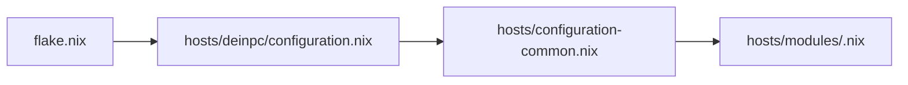
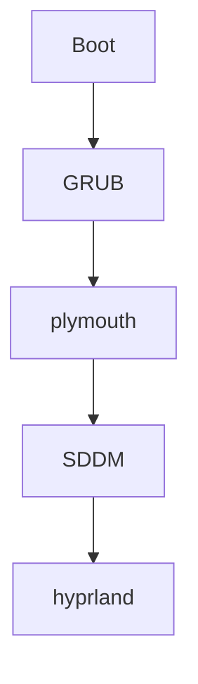

- Weil boot sachen ziemlich tief in system-settings zugreifen müssen, findest du module die beim boot gebraucht werden alle inin /hosts/modules

Der import von den modulen sieht meistens so aus

Der boot flow sieht ungefähr so aus.

- [[Grub]] 
	- Zuständig für die Liste am anfang sieht
	
- [[Plymouth]]
	- Zeigt die boot animation am anfang statt den hässlichen terminal einträgen

- [[SDDM]]
	- das was du siehst bevor du in hyprland reinbootest.
- [[Hyprland]]
	- jetzt bist du im system drin.