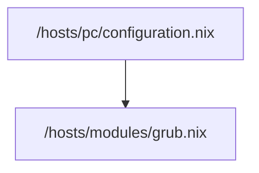

![[Pasted image 20250927222322.png]]

Zuständig für die Liste die man am anfang sieht mit nixos generations oder zB windows wenn man dual boot hat

Wird so importiert

```
{
  boot.loader.systemd-boot.enable = false; # disable systemd-boot
  boot.loader.efi.canTouchEfiVariables = true;

  boot.loader.grub = {
    enable = true;
    device = "nodev"; # EFI-only, no MBR install
    efiSupport = true;
    useOSProber = true; # detects Windows, other Linux installs
  };
}

```
