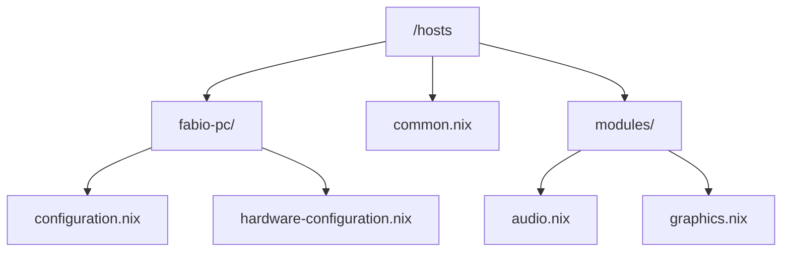
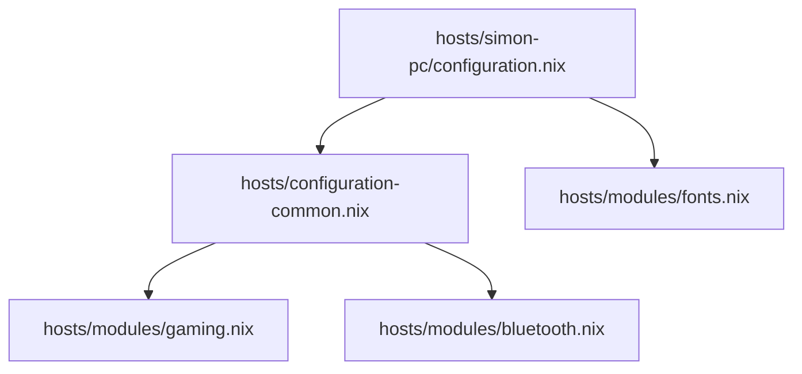

### Hier haben wir 3 Sachen.

### 1. Ein folder für jedes device
- jeder folder hat configuration.nix (hyprland, syncthing usw) und hardware-configuration.nix (CPU usw)

### 2. Module
die wir dann entweder in einzelnen host/configuration.nix importieren oder in mehreren modulen gleichzeitig über die gemeinamen common imports.

### 3. Common files
darunter configuration.common  und configuration-common.nix
das sind files in denen wir mehrere module aus /hosts/modules/... importieren von denen wir wissen, dass wir sie eh in mehreren maschinen haben wollen. Der flow sieht dann so aus.

Im host file importiere ich einzelne hardware module, die ich nur für das System brauche, so wie das configuration-common.nix file, dass dann wiederum viele module importiert.

Für server machen wir übrigens das gleiche, nur, dass wir statt configuration-common.nix configuration-common-server.nix importieren, wo spezifisch nur module drin sind, die man normalerweise für server braucht.

Module, die wir hier drin haben:

-  [[server-modul | server/ ]] 
-  [[syncthing/]]
-  audio.nix
-  bluetooth.nix
-  bootloader.nix
-  energy-management.nix
-  environment-variables.nix
-  fonts.nix
-  gaming.nix
-  gc.nix
-  gnome.nix
-  graphics.nix
-  grub.nix
-  hardware.nix
-  hyprlandWM.nix
-  javascript.nix
-  light.nix
-  locale.nix
-  login.nix
-  mountCloud.nix
-  networking.nix
-  nix-ld.nix
-  nvidia-fabio-lenovo.nix
-  nvidia.nix
-  podman.nix
-  python.nix
-  stylix.nix
-  swap.nix
-  system.nix
-  tailscale.nix
-  userFabio.nix
-  userSimon.nix
