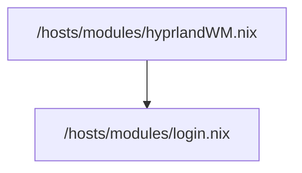

Hyprland ist ein [[Window Manager]].

Hyprland an sich macht eigentlich nicht viel anders als dafür zu sorgen, wie fenster aussehen und hübsche animationen. für viele sachen, die in [[gnome]] oder [[Pop_os]] selbstverständlich sind, müssen wir bei hyprland zusätzliche software verwenden. mehr dazu in [[hyprland modules]].

In unserem Setup findest du **2 Eingangspunkte** für hyprland.
#### 1. /hosts/modules/hyprlandWM.nix
- hier installieren wir hyprland mal grundsätzlich und die Hardware die wir dafür brauchen, dieses modul ist eigentlich eher uninteressant und wirst du auch selten anfassen müssen.
-  wir aktivieren hyprland und deaktivieren [[xserver]] weil hyprland auf [[wayland]] lauft.
```
  # Disable X11 completely
  services.xserver.enable = false;
  programs.xwayland.enable = true;

  # use latest hyprland from unstable
  programs.hyprland = {
    enable = true;
    package = inputs.hyprland.packages.${pkgs.system}.hyprland;
  };
  programs.hyprland.withUWSM = true; # Enable improved hyprland compatibility with uwsm

```

- In diesem File importieren wir login.nix, in dem wir [[SDDM]] importieren.

- Mehr über den [[Boot Flow]] findest du hier.

## 2. /home/modules/hyprland/...

[[hyprland home manager]]
- [[hyprland folder structure]]
