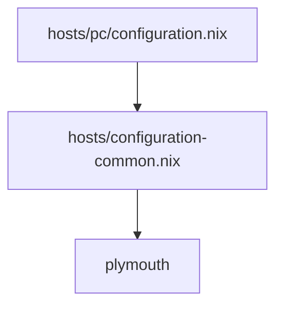

Zeigt die boot animation am anfang statt den hässlichen terminal einträgen

![[Pasted image 20250927222658.png]]
![[Pasted image 20250927222719.png]]

Alle hosts importieren das über das configuration-common modul.

![[Pasted image 20250927222932.png]]