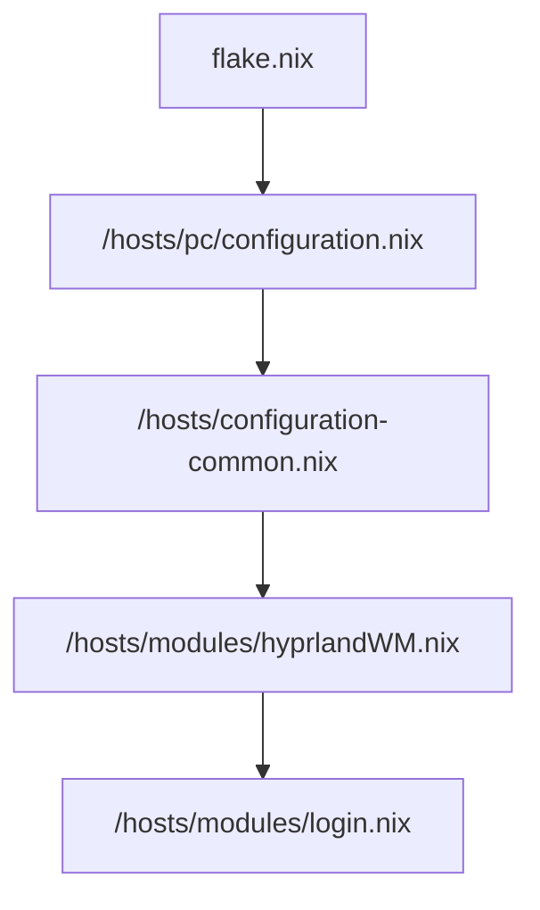

Das login fenster das du siehst bevor du in hyprland reinbootest
![[Pasted image 20250927223008.png]]

Wird so importiert

```mermaid
graph TD
A["flake.nix"] --> B["/hosts/pc/configuration.nix"]
B --> C["/hosts/configuration-common.nix"]
C --> D["/hosts/modules/hyprlandWM.nix"]
D --> E["/hosts/modules/login.nix"]
```
