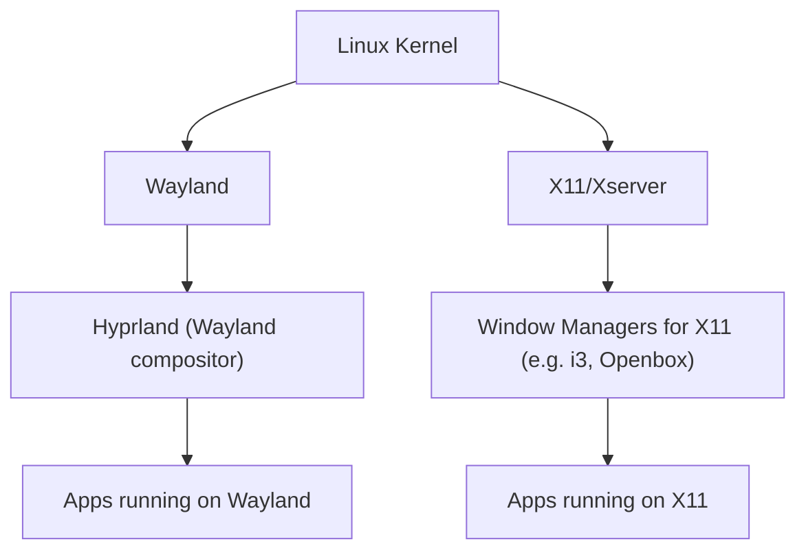

Ein Window Manager läuft _oben drauf_ auf dem [[xserver]]. Er bestimmt, **wie die Fenster aussehen und angeordnet sind** – z. B. ob sie kachelartig wie bei [[gnome]] oder frei verschiebbar sind. Der [[xserver]] zeichnet, der Window Manager organisiert.
https://www.youtube.com/watch?v=LAaul9OlxNc

- **Hyprland**

