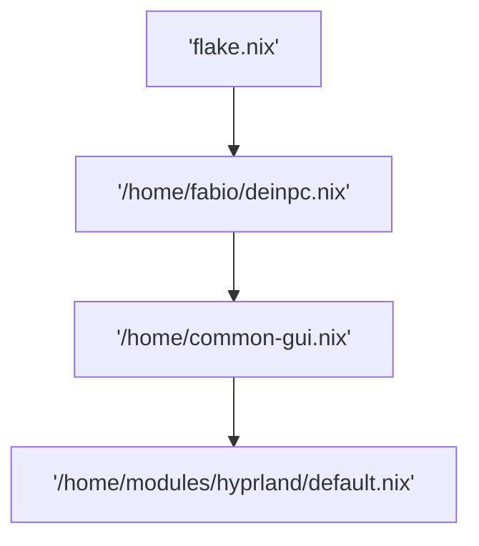

Hier haben wir fast alles eingestellt, was hyprland angeht. der import flow von diesem modul sieht ungefähr so aus.



Wie du siehst dein pc importiert common-gui wo hyprland drin ist, alle geräte die kein server sind importieren common-gui und common gui importiert immer hyprland. in anderen worten alle geräte, die kein server sind, verwenden hyprland. 
Theoretisch könnten geräte stattdessen auch [[gnome]], [[kde]] oder sonstwas verwenden aber wir haben uns für hyprland entschieden, weil es wegen seinem modernen look als state of the art zaehlt.

### /home/hyprland/default.nix

Das ist der Eingangspunkt in das Hyprland modul. Hier passieren 2 Dinge.
1. wir importieren alle [[hyprland modules]], die wir benötigen werden.

```
{
  inputs,
  pkgs,
  ...
}: {
  imports = [
    ./hyprland.nix
    #./swaylock.nix
     ...
  ];
```

2. wir installieren alle programme, die wir für hyprland brauchen werden.

#TODO programme beschrieben
```

  home.packages = with pkgs; [
    libnotify # User-level notifications
    playerctl # Media control via DBus which is a message bus system,  a way for applications to talk to each other
    tesseract # this is for  optical character recognition
    uwsm
  ];
}

```