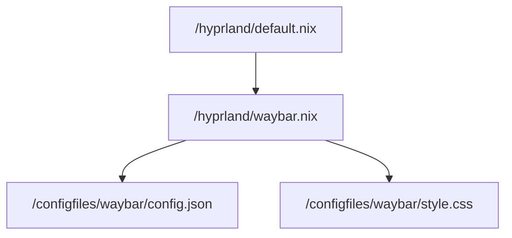

The thing that displays this bar on top
![[Pasted image 20250927214124.png]]


Module that we are importing in the [[Hyprland]] Window manager.

it's what shows the bar on top.

in home/modules we import them like this


- In hyprland.waybar.nix ist der code um die 2 waybar files von configfiles in ~/.config/waybar zu moven.
``` nix
  home.file.".config/waybar/" = {
    source = builtins.path {path = ../../configfiles/waybar;};
    recursive = true;
  };
```

- unser PC schaut immer in ~/.config/ ob er zB waybar oder sonst andere files findet

### config.json
wir definieren die module, zB das custom [[batterie]] modul.

```json
    "backlight": {
      "device": "intel_backlight",
      "format": "{icon} ",
      "format-icons": [
        "", "", "", "", "", "", "", "", ""
      ]
    },
```

### style.css
da definieren wir in css den style von waybar